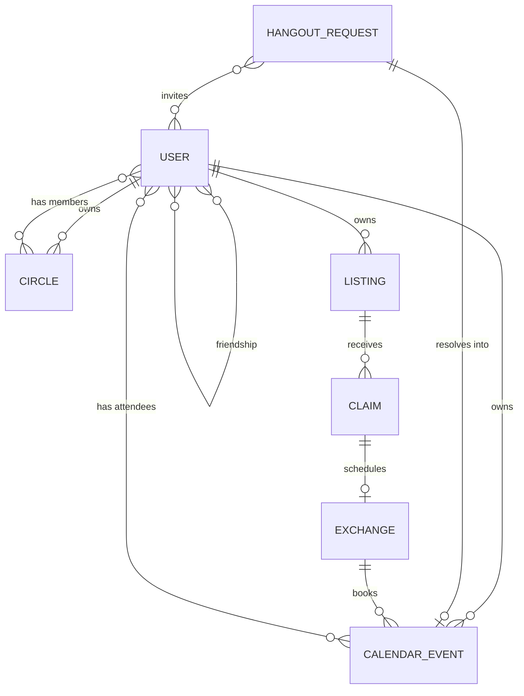

# Domain model

Every type named here is defined once, as a Zod schema, in
[`packages/contracts`](../../packages/contracts/src/). This document explains the
*reasoning*; the schema files are the specification.

## Entity map

## Identity

`User` carries no email, no phone, no password hash. Those live in a separate
credential store the application layer does not casually read. What remains is
the shape that is safe to load into ordinary business logic — so a handler that
accidentally serialises a `User` leaks a display name, not a contact list.

`PublicProfile` is the non-friend view: id, handle, display name, avatar. Handle
enumeration therefore yields nothing worth harvesting.

## Social graph

**`Friendship`** is one row with a canonical ordering (`lowUserId <
highUserId`). One row means the pair is unique and cannot drift into a
half-accepted state that is visible from one side only.

**`Block` is a separate directed record, not a friendship status.** This is
deliberate. If blocking were a status value, unblocking would have to decide
what to restore, and a friendship state transition could overwrite a block. As
its own record, a block survives every other change, and unblocking never
silently reinstates a friendship.

Repositories must return `BLOCKED` when a block exists in **either** direction.
Collapsing both directions at the port boundary means no caller can forget the
other way round.

**`Circle`** is a named subset of a user's friends, visible only to its owner.
Circles are the unit of calendar sharing: they let a user be specific without
publishing a taxonomy of their social life. Bob is never told he is in
"Reluctant Work Friends".

## Calendar

`CalendarEvent` is the **stored** shape and must never reach a client. Only
`projectEvent()` output crosses the network boundary. See
[the visibility spec](visibility-and-privacy.md).

Two sharing controls, and they do different jobs:

- **`shareRules`** — grants. Additive, maximum wins. Empty means *inherit the
  owner's defaults*, not *deny*.
- **`visibilityCeiling`** — a cap. It exists so a user can drop one sensitive
  event below their general defaults without reasoning about which of their
  circles those defaults happen to cover. Denying is what the ceiling is for.

`TimeRange` is half-open, `[start, end)`. This is the only sane choice for a
calendar: back-to-back events must not register as overlapping.

`AvailabilityWindow` is *not* free/busy. It is consent to be asked — when a user
is open to receiving hangout requests. A friend proposing a time inside these
windows is not intruding; outside them, the UI warns before sending.

## Hangout requests

The product thesis is that a request can sit unanswered without it being rude.
Two consequences fall out of that:

1. **Requests expire.** `expiresAt` is required. A request that quietly ages out
   is socially cheaper than one you must actively decline, and it stops the
   inbox becoming a guilt pile. `EXPIRED` is not a rejection.
2. **No read receipts, no typing indicators, no "seen" state — anywhere.**
   Those signals reintroduce exactly the synchronous pressure the product
   exists to remove. This is a product constraint with a schema consequence:
   there is no field to put them in.

Slots are capped at 10. A request with thirty options is a scheduling burden
dressed up as flexibility.

Transitions live in `HANGOUT_TRANSITIONS` as data, so the state machine and its
tests read from one table rather than two hand-written switches that drift.

## Marketplace

`Listing.audience` reuses the calendar's `Audience` type rather than inventing a
parallel one. One audience vocabulary across the product means one place to get
the privacy semantics right and one place to review them.

**Discoverability and claimability are separate gates.** A `PUBLIC` listing can
be seen by anyone, but claiming it still requires friendship — because a claim
ends with two people arranging to meet in person.

`photoKeys` are opaque storage keys, never client-supplied URLs. Accepting a URL
here would hand us SSRF and a phishing vector in one field.

`Exchange` is the only place the product moves people into physical proximity,
so it is the only place with an explicit safety story: locations are free text
chosen by the participants and never auto-filled from a stored address (we store
none), and the calendar events it books are capped at `BUSY`.

## Invariants

Machine-checked where the checking column says so.

| Invariant | Enforced by |
|---|---|
| A block outranks friendship, circles, and `PUBLIC` | `visibility.ts` rule 2; `visibility.test.ts` |
| Stored events never reach a client unprojected | `projection.ts` whitelist; `projection.test.ts` key assertion |
| Absent sharing config yields the conservative default | `MemoryCalendar.sharingDefaults`; port contract |
| Every route declares an authz spec | `RouteDefinition.authz` is required; `routes.test.ts` |
| Every public route carries a real justification | `routes.test.ts` (length floor) |
| Every declared action has test coverage | `actions.test.ts` backstop |
| Ids of different entities cannot be swapped | Branded types in `primitives.ts` |
| Calendar windows are bounded | `CalendarQuery` refinement; `server.test.ts` |

## Not yet modelled

`Rsvp` as a first-class record (currently implied by `attendeeIds`),
notifications, moderation and reporting, recurring events, and multi-party
exchanges. Recurrence in particular will be intrusive: it touches
`eventsInWindow`, every projection path, and the busy-merge logic. Treat it as
its own ADR, not a field addition.
