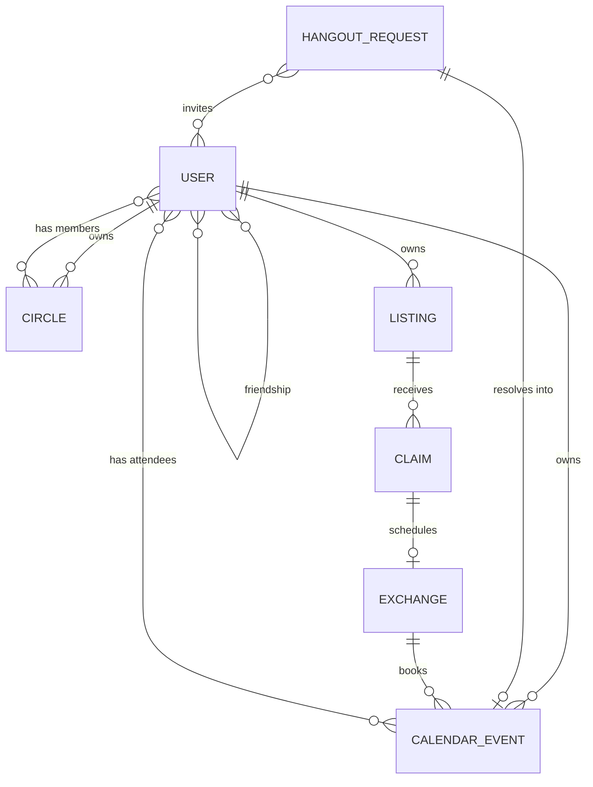

# Domain model

Every type named here is defined once, as a Zod schema, in
[`packages/contracts`](../../packages/contracts/src/). This document explains the
*reasoning*; the schema files are the specification.

## Entity map

## Identity

`User` carries no email, no phone, no password hash. Those live in a separate
credential store the application layer does not casually read. What remains is
the shape that is safe to load into ordinary business logic - so a handler that
accidentally serialises a `User` leaks a display name, not a contact list.

`PublicProfile` is the non-friend view: id, handle, display name, avatar. Handle
enumeration therefore yields nothing worth harvesting.

## Social graph

**`Friendship`** is one row with a canonical ordering (`lowUserId <
highUserId`). One row means the pair is unique and cannot drift into a
half-accepted state that is visible from one side only.

**A friend request is that same row with `status: 'PENDING'`**, plus
`requestedBy` - not a second table
([ADR 0028](../adr/0028-friend-requests-and-blocking.md)). A request table
alongside a friendship table is two places that can disagree about whether two
people are friends, and the disagreement is a visibility decision. `requestedBy`
is what stops the sender accepting their own ask.

`PENDING` grants **nothing**. It is not a weaker `FRIEND`: `audienceMatches`
tests for `FRIEND` exactly, and `friendsOf` filters on `ACCEPTED`. Asking to be
someone's friend must not be enough to read their calendar.

**Declining deletes the row.** A stored `DECLINED` would answer "did they turn
me down, or have they just not looked yet?", and the sender is not owed that.

**`Block` is a separate directed record, not a friendship status.** This is
deliberate. If blocking were a status value, unblocking would have to decide
what to restore, and a friendship state transition could overwrite a block. As
its own record, a block survives every other change, and unblocking never
silently reinstates a friendship.

**Directed means two rows for a mutual block**, keyed `(blocker_id,
blocked_id)`. This is not symmetry for its own sake. With one canonically
ordered row per pair, Alice unblocking Bob would delete the only row and lift
*Bob's* block on Alice at the same time - handing the person Bob wanted away
from him the power to undo his protection. Each party owns their own row and
can only ever remove that one.

Repositories must still return `BLOCKED` when a block exists in **either**
direction. Collapsing both directions at the port boundary means no caller can
forget the other way round; keeping two rows underneath means no caller can
destroy the other party's.

**`Circle`** is a named subset of a user's friends, visible only to its owner.
Circles are the unit of calendar sharing: they let a user be specific without
publishing a taxonomy of their social life. Bob is never told he is in
"Reluctant Work Friends".

Now that circles are manageable ([ADR 0023](../adr/0023-circle-management.md)),
that sentence is a rule with teeth:

- **No endpoint answers "which circles am I in"**, for anyone. The tempting
  features that would break this are a profile line ("you're in 3 of Alice's
  circles") and a checkup that explains *why* a viewer can see something. The
  checkup already answers the safe form - *what* they can see.
- **Rosters outlive friendships.** Unfriending does not scrub them, because
  `audienceMatches` re-checks friendship at read time and a stale entry grants
  nothing. The owner sees such entries marked inactive rather than silently
  removed.
- **Deleting a circle scrubs the `CIRCLE` rules that named it** from the owner's
  events and defaults. A rule naming a gone circle already fails closed, so the
  scrub is tidiness backed by a safe default rather than the control.

## Calendar

`CalendarEvent` is the **stored** shape and must never reach a client. Only
`projectEvent()` output crosses the network boundary. See
[the visibility spec](visibility-and-privacy.md).

Two sharing controls, and they do different jobs:

- **`shareRules`** - grants. Additive, maximum wins. Empty means *inherit the
  owner's defaults*, not *deny*.
- **`visibilityCeiling`** - a cap. It exists so a user can drop one sensitive
  event below their general defaults without reasoning about which of their
  circles those defaults happen to cover. Denying is what the ceiling is for.

`TimeRange` is half-open, `[start, end)`. This is the only sane choice for a
calendar: back-to-back events must not register as overlapping.

`AvailabilityWindow` is *not* free/busy. It is consent to be asked - when a user
is open to receiving hangout requests. A friend proposing a time inside these
windows is not intruding; outside them, the UI warns before sending.

## Hangout requests

The product thesis is that a request can sit unanswered without it being rude.
Two consequences fall out of that:

1. **Requests expire.** `expiresAt` is required. A request that quietly ages out
   is socially cheaper than one you must actively decline, and it stops the
   inbox becoming a guilt pile. `EXPIRED` is not a rejection.
2. **No read receipts, no typing indicators, no "seen" state - anywhere.**
   Those signals reintroduce exactly the synchronous pressure the product
   exists to remove. This is a product constraint with a schema consequence:
   there is no field to put them in.

Slots are capped at 10. A request with thirty options is a scheduling burden
dressed up as flexibility.

Transitions live in `HANGOUT_TRANSITIONS` as data, so the state machine and its
tests read from one table rather than two hand-written switches that drift.

## Marketplace

`Listing.audience` reuses the calendar's `Audience` type rather than inventing a
parallel one. One audience vocabulary across the product means one place to get
the privacy semantics right and one place to review them.

**Discoverability and claimability are separate gates.** A `PUBLIC` listing can
be seen by anyone, but claiming it still requires friendship - because a claim
ends with two people arranging to meet in person.

`photoKeys` are opaque storage keys, never client-supplied URLs. Accepting a URL
here would hand us SSRF and a phishing vector in one field. The bytes behind a
key are served only through `GET /v1/listings/:id/photos/:key`, which re-checks
`listing:view` - so a key that leaks into a log, a referrer, or a screenshot is
not a bearer token for someone's belongings.

### How a thing finds its next home

`Listing.claimMode` is one of three, fixed at creation
([ADR 0017](../adr/0017-claim-modes-and-deadlines.md)):

| Mode | A claim means | Resolves by |
|---|---|---|
| `FIRST_COME` | "I'll take it" | Accepted on arrival; the listing goes `CLAIMED` in the same write |
| `LOTTERY` | "Enter me" | The owner draws once, at random, after the deadline |
| `OWNER_SELECTS` | "I'd like that" | The owner accepts one, whenever they choose |

`claimsCloseAt` means the same thing in every mode - after it, no new claims -
so there is one field and one comparison rather than three of each.

Two rules in the kernel are load-bearing rather than incidental:

- **The owner cannot hand-pick under `LOTTERY`.** `claim:decide` requires
  `OWNER_SELECTS`. Without it a draw is a draw in name only, and the entrants
  were told otherwise.
- **A lottery with no deadline can never be drawn.** `listing:draw` requires the
  deadline to have passed, and an absent deadline never passes. Drawing whenever
  you like is picking. The create route refuses the combination up front so it
  cannot be reached by accident.

The draw itself is pure: `drawWinner(entries, unitInterval)` takes a number in
`[0, 1)` from the caller, so the kernel reads no random source and a test can
assert exactly who wins. The route supplies `crypto.getRandomValues`.

**Claimants never learn about each other.** `projectListing` returns `yourClaim`
- the viewer's own - and omits `claims` entirely for anyone but the owner.
Absent rather than empty: zero is a number, and a count of interest is a
disclosure about the people who expressed it.

### The handoff

`Exchange` is the only place the product moves people into physical proximity,
so it is the only place with an explicit safety story
([ADR 0019](../adr/0019-the-handoff.md)).

`PROPOSED → SCHEDULED → COMPLETED | CANCELLED`. Either party proposes a time and
place; the **other** accepts - the proposer cannot accept their own proposal, so
"we agreed" is never one person clicking twice. Nothing touches a calendar until
that acceptance.

Accepting writes one event to **each** participant's calendar with
`visibilityCeiling: 'BUSY'`. The ceiling is doing precise work:

- A third party resolves through `minVisibility(granted, ceiling)`, so the most
  anyone else learns is that this person is occupied. At `BUSY`, `projectEvent`
  emits a time range and nothing else - no title, no location, no attendees.
- Both participants still see everything, because the attendee branch of
  `resolveEventVisibility` returns `FULL` **before** the ceiling clamp.

This is the opposite of an accepted hangout, which uses `FULL`. A hangout is a
social plan; a handoff is an address. A consequence worth knowing before you
report it as a bug: an owner's own "most anyone else can see" badge reads *Busy*
on a handoff, and that is correct.

**Cancelling deletes both calendar copies** rather than marking them cancelled -
unlike a cancelled event, which survives for its owner. A handoff that is off
should leave no trace on anyone's week, because a slot that frees up at short
notice is itself information. Either party may cancel, at any point before
completion, and no reason is asked for or stored.

`location` is free text two people agreed between themselves. It is never
auto-filled, never geocoded, and there is deliberately **no venue database, no
map, and no location history** - each would mean accumulating a record of where
our users physically meet.

## Reporting and moderation

A `Report` is the record; the email to `reports@friends-zone.app` carries only a
report id, a reason code, and a subject kind
([ADR 0018](../adr/0018-reporting-and-moderation.md)). `NotifierPort` takes no
other parameters, so there is no content for an adapter to leak.

**Evidence is snapshotted at file time.** `EvidenceSnapshot` freezes the reported
text and photo keys, which both survives the subject deleting the material and
bounds moderator access: there is no moderator branch anywhere in the visibility
engine, so a moderator reads snapshots attached to reports and nothing else. Not
the live listing, not anyone's calendar.

**Two one-way threads.** Every `ReportNote` carries `audience: REPORTER |
SUBJECT`. There is no `BOTH` member, and adding one would collapse the guarantee.

| | Reporter | Subject | Moderator |
|---|---|---|---|
| `reporterId` | (is them) | ❌ never | ✅ |
| `detail` (reporter's words) | ✅ own | ❌ never | ✅ |
| filing time | ✅ | ❌ | ✅ |
| `EvidenceSnapshot` | ❌ | ❌ | ✅ |
| `REPORTER` notes | ✅ | ❌ | ✅ |
| `SUBJECT` notes | ❌ | ✅ | ✅ |
| which moderator replied | ❌ | ❌ | n/a |

The subject is told nothing at all until a moderator opens a thread with them:
"you have been reported", arriving promptly, identifies the reporter about as
well as naming them would.

**Reporting survives a block.** The report actions are in `BLOCK_EXEMPT_ACTIONS`,
because blocks are bidirectional and an abuser must not be able to block their
victim into silence. Filing is still not seeing - the material is projected as
the reporter before it is captured, so a blocked reporter can name the person and
still read none of their content.

**Moderators are a deploy-time allowlist** (`MODERATOR_IDS` → `ViewerContext.isModerator`),
never a database column and never a field on `User`.

## Invariants

Machine-checked where the checking column says so.

| Invariant | Enforced by |
|---|---|
| A block outranks friendship, circles, and `PUBLIC` | `visibility.ts` rule 2; `visibility.test.ts` |
| Stored events never reach a client unprojected | `projection.ts` whitelist; `projection.test.ts` key assertion |
| Absent sharing config yields the conservative default | `MemoryCalendar.sharingDefaults`; port contract |
| Every route declares an authz spec | `RouteDefinition.authz` is required; `routes.test.ts` |
| Every public route carries a real justification | `routes.test.ts` (length floor) |
| Every declared action has test coverage | `actions.test.ts` backstop |
| Ids of different entities cannot be swapped | Branded types in `primitives.ts` |
| Calendar windows are bounded | `CalendarQuery` refinement; `server.test.ts` |

## Not yet modelled

`Rsvp` as a first-class record (currently implied by `attendeeIds`),
notifications, moderation and reporting, recurring events, and multi-party
exchanges. Recurrence in particular will be intrusive: it touches
`eventsInWindow`, every projection path, and the busy-merge logic. Treat it as
its own ADR, not a field addition.
