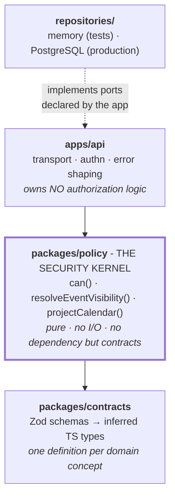
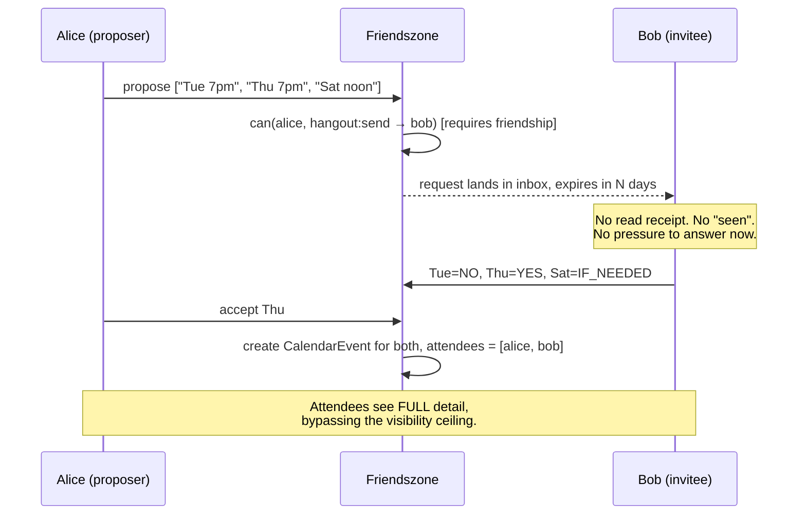
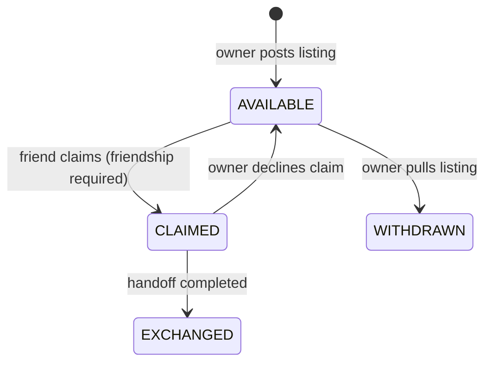

# Architecture overview

## What the product is

Friendszone coordinates plans between people who already know each other. Four
capabilities, one shared spine:

| Capability | What it does |
|---|---|
| **Calendar** | You keep a schedule; friends see a filtered projection of it. |
| **Hangout requests** | A friend proposes times. You answer whenever. Nothing expects you *now*. |
| **RSVPs** | Confirmed plans collect yes/no/maybe from invitees. |
| **Secondhand exchange** | Post an item, a friend claims it, you schedule a handoff. |

The spine is the calendar. Requests resolve into calendar events; accepted
exchanges book calendar events; RSVPs attach to calendar events. Get the
calendar's privacy semantics right and the rest inherits them.

## The one-sentence version of the design

> Stored data is never returned to a client - only a **projection** computed for
> one specific viewer by a pure function that has no database access.

## Layers

Dependencies point **inward only**, and the dashed edge is the inversion that
makes it work: the repositories implement interfaces the application declares,
so the arrow of dependency runs opposite to the arrow of data. `packages/policy` cannot import
from `apps/api`; it cannot import a database driver; it cannot read the clock or
the environment. That constraint is what makes every authorization decision
reproducible from its arguments, and therefore exhaustively testable - which is
why the security-critical code is also the best-tested code in the repo.

## Request lifecycle

Reading a friend's calendar, end to end:

1. **Transport** - Fastify matches the route. Params and query are parsed by the
   route's Zod schemas. A failure here is a `400` with no detail.
2. **Authentication** - resolves an `actorId` or `null`. Never throws for
   anonymous; anonymity is a valid state, not an error.
3. **Context** - the handler calls `ctx.viewerFor(ownerId)`, which builds a
   `ViewerContext` *for that owner specifically*. It cannot be built without
   naming whose data is about to be touched.
4. **Coarse gate** - `can(viewer, { action: 'calendar:view', ownerId })`. This
   rejects very little. Its job is to catch categorically forbidden actions, not
   to filter data.
5. **Fetch** - the repository returns raw, unfiltered rows.
6. **Projection** - `projectCalendar()` decides, per event, what this viewer
   sees. This is where privacy actually happens.
7. **Response** - headers include `cache-control: no-store`, because the payload
   is viewer-specific and a shared cache serving it to someone else would defeat
   the entire model.

Steps 4 and 6 are separate on purpose, and the reason is subtle enough to be
worth stating: **a stranger asking for your calendar gets `200 {busy: [],
details: []}`, not `403`.** A 403 confirms the account exists. An empty calendar
is indistinguishable from a real user with a quiet week.

## Key flows

### Asynchronous hangout request

Expiry is a feature. A request that quietly ages out is socially cheaper than
one the recipient must actively decline, and `EXPIRED` is deliberately not
modelled as a rejection.

### Secondhand exchange

Multiple claims may be `PENDING` at once and accepting one does not auto-decline
the rest - the owner may want a backup if the first handoff falls through.

Scheduling the handoff creates a calendar event for both parties with
`visibilityCeiling: BUSY`. Third parties learn that someone is occupied. They
never learn where, or with whom. See the safety rationale in
[the threat model](../security/threat-model.md).

## Where the interesting decisions are written down

- [Visibility and privacy](visibility-and-privacy.md) - the normative spec for
  the projection algorithm. Read this before touching `packages/policy`.
- [Domain model](domain-model.md) - entities, relationships, lifecycles.
- [Threat model](../security/threat-model.md) - assets, adversaries, abuse cases.
- [Authorization model](../security/authz-model.md) - how `can()` is meant to be used.
- [ADRs](../adr/) - decisions with their reasoning and their alternatives.

## Current state

Real and tested: contracts, policy engine, HTTP edge, route-perimeter
invariants, in-memory adapters.

Deliberately absent: persistence, authentication, the web client, notifications.
Each is an ADR explaining what it must satisfy when it arrives. The API refuses
to boot in production precisely so the authentication gap cannot be deployed by
accident.
