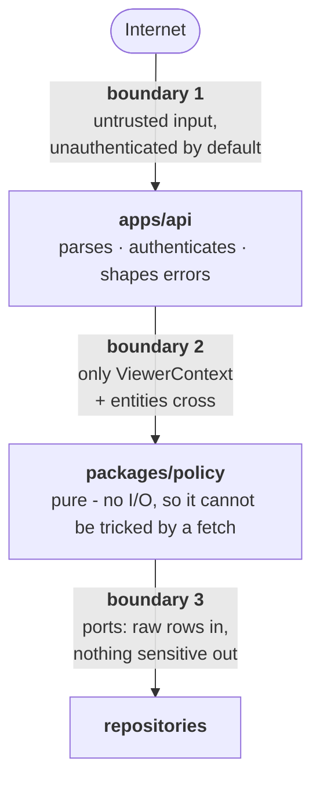

# Threat model

Scope: the Friendszone application as designed in this repository. Revisit this
document whenever a new capability is added, and specifically whenever a change
touches the calendar projection, the social graph, or the exchange flow.

## What we are actually protecting

Ranked by how badly a breach hurts a real person, not by how interesting it is
technically.

| Asset | Why it matters | Where it lives |
|---|---|---|
| **Calendar patterns** | Reveals where someone is, when, and when their home is empty. The single most dangerous dataset here. | `CalendarEvent`, free/busy projections |
| **Social graph** | Who knows whom, and the shape of someone's circles. Enables targeted pretexting. | `Friendship`, `Circle`, `Block` |
| **Block relationships** | Learning you have been blocked reliably triggers escalation and evasion. | `Block` |
| **Exchange meetups** | A specific person, at a specific place, at a specific time. | `Exchange` |
| **Listing photos** | Pictures of possessions, usually taken indoors at home. Backgrounds leak more than the object does. | `Listing.photoKeys` → photo store |
| **Who wants what** | That someone asked for an item is a social signal about them, not about the item. | `Claim.claimantId`, `.message` |
| **Reporter identity** | Learning who reported you is the precondition for retaliating against them. The single most dangerous field in the moderation model. | `Report.reporterId`, `.detail` |
| **Event content** | Titles and locations: "oncology appointment", "AA meeting". | `CalendarEvent.title`, `.location` |
| **Credentials/session** | Account takeover yields everything above. | Credential store (not yet built) |

The recurring theme: this product's worst-case failure is not financial. It is
enabling someone to physically locate a person who is avoiding them.

## Trust boundaries

Boundary 2 is the interesting one. Because the policy engine performs no I/O, an
attacker cannot influence a decision by poisoning a cache the engine consulted
on its own - every input is explicit and supplied by the caller. It also means
an auditor can read the whole security kernel in one sitting.

## STRIDE

| | Threat | Mitigation | Status |
|---|---|---|---|
| **S** | Session theft / fixation | Opaque 256-bit token in an `HttpOnly`, `SameSite=Lax`, `Secure` cookie; **stored hashed**; fresh session on every login ([ADR 0024](../adr/0024-authentication.md)) | ✅ tested |
| **S** | Session store dump yields usable credentials | Only SHA-256 of each token is stored - what is held cannot be presented | ✅ tested |
| **I** | **Login reveals whether an account exists** | Identical body, status, *and* timing: a dummy scrypt hash is computed for unknown emails | ✅ tested |
| **I** | Registration reveals whether an email is in use | One message for email and handle collisions, and the tightest rate-limit class. **Not closed** - the fix is a verification email, which needs mail delivery | ⚠️ known gap |
| **I** | **Restricted data is at rest in the database** | Passwords are scrypt hashes and session tokens SHA-256, so it is not a plaintext credential dump. **Encryption at rest is the deployment's job**, and field-level encryption of 🟠 Sensitive columns is still outstanding ([ADR 0004](../adr/0004-persistence.md)) | ⚠️ partial |
| **E** | A handler bug writes to another user's rows | RLS policies express ownership; `app.actor_id` is set per transaction. Sanctioned cross-owner writes must opt in with `app.cross_owner` | ✅ tested |
| **S** | Spoofed `X-Forwarded-For` mints a fresh rate-limit bucket per request | `trustProxy` is a bounded hop count, never `true`; defaults to 0, which over-limits rather than allowing a bypass ([ADR 0027](../adr/0027-deploy-on-aws.md)) | ✅ |
| **E** | Injected script executes in the app origin | Content-Security-Policy on every response: `default-src 'self'`, no `unsafe-eval`, `object-src 'none'`, `frame-ancestors 'none'` | ✅ |
| **I** | A CDN caches one viewer's projection and serves it to another | Every response carries `cache-control: no-store`, and the `/api/*` CloudFront behaviour disables caching explicitly | ✅ |
| **I** | SQL injection | Every value is a bind parameter; no data is interpolated into SQL anywhere in the adapter | ✅ |
| **T** | Two claims from one person on one listing | Kernel refuses it, and a unique constraint is the wall that refusal hits | ✅ tested |
| **S** | Offline attack on stolen password hashes | scrypt, `N=2^16, r=8, p=1`, per-password salt, self-describing so parameters can be raised | ✅ tested |
| **E** | Credential stuffing / brute force | Login and registration draw from `UPLOAD`, the tightest bucket ([ADR 0020](../adr/0020-rate-limiting.md)) | ✅ tested |
| **T** | CSRF on a state-changing route | `SameSite=Lax` plus a required `application/json` content type, which an HTML form cannot send | ✅ |
| **E** | XSS lifts the session | The cookie is `HttpOnly`; no token is ever in `localStorage` or readable by script | ✅ tested |
| **S** | Deleted account keeps working, or logs back in | Deletion revokes every session and erases credentials before tombstoning | ✅ tested |
| **S** | Forged `x-dev-actor-id` in production | The header is ignored entirely when `NODE_ENV=production`, and a present-but-invalid session cookie never falls through to it | ✅ tested |
| **T** | Client tampers with ids to read another calendar | Every id parsed as a branded UUID; per-owner `ViewerContext`; per-event projection | ✅ tested |
| **T** | Handler mutates another user's event | `event:modify` requires ownership | ✅ tested |
| **R** | Denies sending a request | Append-only request records with timestamps | ⚠️ partial - no audit log yet |
| **I** | **Calendar detail leaks to non-friends** | Default-deny lattice, whitelist projection, conservative defaults | ✅ tested |
| **I** | **Slot finder differencing reconstructs a calendar** | The intersection runs over per-viewer *projections*, so there is no privileged data to difference - varying the participant set gains nothing | ✅ tested |
| **I** | Slot suggestions reveal exact event boundaries | Free windows are quantized inward to a 15-minute grid, start up and end down | ✅ tested |
| **I** | Slot finder used to probe whether an account exists | An unknown id and someone who shares nothing produce byte-identical answers | ✅ tested |
| **D** | Slot query fan-out as an amplification vector | Participants capped at 20, window capped at 62 days, one batched relationship lookup, and its own `EXPENSIVE` bucket | ✅ tested |
| **I** | **A member learns which circles they are in, or what they are called** | No endpoint answers it; every circle route names an owner and requires it to be the caller | ✅ tested |
| **I** | A circle name leaks through the calendar that the circle grants access to | Circle ids and names never appear in a projection - only the resulting level does | ✅ tested |
| **I** | Error codes reveal existence | Denials collapse to an indistinguishable `404` | ✅ tested |
| **I** | Blocked user detects the block | `calendar:view` exempt from the block gate; empty result instead of `404` | ✅ tested |
| **I** | Busy-block boundaries reveal event count | Merged on `<=`, ids stripped, clipped to window | ✅ tested |
| **I** | Shared cache serves one viewer's calendar to another | `cache-control: no-store` on every response | ✅ tested |
| **I** | Stack traces expose internals | `errorToResponse` returns bare codes; details stay in logs | ✅ tested |
| **D** | Bulk export via huge window | 62-day cap | ✅ tested |
| **D** | Bulk export by *repetition* - many individually-safe reads | Per-actor `READ` bucket. This is the control ADR 0008 leans on to bound the slot finder | ✅ tested |
| **D** | Rate-limit table itself exhausts memory | Bounded at 50k keys, oldest evicted first | ✅ |
| **S** | Caller claims another's id to exhaust *their* budget | Closed in production: the bucket key comes from a session the caller cannot forge. The dev header remains outside production only | ✅ tested |
| **D** | Oversized payloads | 256 KiB body limit; photo upload opts into a larger cap explicitly, per route | ✅ tested |
| **I** | Photo key leaks (log, referrer, screenshot) and becomes a public URL | Keys are not capabilities: serving re-checks `listing:view`, and the key must belong to that listing | ✅ tested |
| **I** | Fellow claimants enumerate each other | `projectListing` omits `claims` for non-owners - absent, not empty, so there is no count either | ✅ tested |
| **T** | Owner rigs a lottery by hand-picking the winner | `claim:decide` requires `OWNER_SELECTS`; a draw is the only way to resolve a `LOTTERY` | ✅ tested |
| **T** | Owner re-runs a draw until they like the result | Drawing sets the listing `CLAIMED`, and `listing:draw` requires `AVAILABLE` | ✅ tested |
| **E** | Stored XSS via an uploaded SVG | Format sniffed from magic bytes; SVG and every unlisted format refused | ✅ tested |
| **I** | **Export leaks the reporter of a report about the exporter** | Export is built from the same projections as the API; `reportsAboutYou` uses `projectReportForSubject` | ✅ tested |
| **T** | Deletion used to escape an open moderation case | Live cases about the deleting user, and their evidence, survive | ✅ tested |
| **T** | Delete-and-rejoin used to reach someone who blocked you | Blocks are never cleared by deletion ([ADR 0004](../adr/0004-persistence.md)) | ✅ tested |
| **T** | Deletion used to erase another person's record of a shared plan | Each participant owns their own copy; deletion touches only the caller's | ✅ tested |
| **I** | **Subject learns who reported them** | Two one-way threads; `projectReportForSubject` carries no `reporterId`, no `detail`, no filing time | ✅ tested |
| **I** | Timing of "you were reported" identifies the reporter | The subject is told nothing until a moderator deliberately opens a thread | ✅ tested |
| **I** | Party learns which moderator handles their case | Moderator notes store `authorId: null`; views expose a boolean, never an id | ✅ tested |
| **I** | Report filing probes whether an id exists | Material is projected before capture; unseen and nonexistent return the identical 404 | ✅ tested |
| **E** | Moderator role used as a master key over all data | No moderator branch exists in the visibility engine; access is bounded to evidence snapshots on reports | ✅ tested |
| **E** | Moderator role self-assigned through the API | `MODERATOR_IDS` is a boot-time config value, not a column and not a profile field | ✅ tested |
| **I** | **Third party learns where and with whom someone is meeting** | Handoff events carry `visibilityCeiling: 'BUSY'`; at BUSY `projectEvent` emits a time range and nothing else | ✅ tested |
| **I** | A cancelled handoff still occupies a slot, and the gap is itself a signal | Cancelling **deletes** both calendar copies rather than marking them cancelled | ✅ tested |
| **T** | One party books a meeting the other never agreed to | Nothing is written to a calendar until the *other* party accepts; the proposer cannot accept their own proposal | ✅ tested |
| **I** | Location data accumulates into a record of where users meet | `location` is free text, never geocoded; no venue database, no map, no history | ✅ |
| **T** | Abuser blocks their victim to prevent a report | Report actions are block-exempt, so a block cannot strip anyone of the ability to report | ✅ tested |
| **D** | Report queue flooded by one person | One live report per reporter/subject pair | ✅ tested |
| **D** | Mass-reporting used to suppress a rival's content | Takedown is a human decision; nothing is auto-hidden on report | ✅ |
| **I** | Report content leaks via the notification email | The notifier's signature accepts only a report id, reason, and subject kind | ✅ tested |
| **D** | Request flooding | Per-actor token buckets at the edge, declared per route ([ADR 0020](../adr/0020-rate-limiting.md)) | ✅ tested |
| **D** | Photo store exhaustion by repeated upload | Per-file cap, per-listing cap, and a per-actor `UPLOAD` bucket - the tightest class | ✅ tested |
| **E** | Route ships without an authz check | `authz` is a required field; perimeter tests assert the public allowlist | ✅ tested |
| **E** | New action ships unreviewed | `can()` is exhaustive; `ALL_ACTIONS` coverage backstop | ✅ tested |

## Abuse cases

Ordinary users misusing intended features. These matter more than exotic
exploits, because they need no skill and they happen at scale.

### Stalking via free/busy

**Attack.** Someone befriends a target, or keeps an old friendship alive, and
polls the free/busy endpoint to learn their routine - gym Tuesdays, empty house
Saturday mornings.

**Mitigations in place.** Conservative defaults mean a new friend sees `BUSY`
only. Busy blocks are merged and clipped. Windows are capped.

**Gaps.** Repeated polling still reconstructs a routine over time. Needs rate
limiting plus per-viewer access visibility ("Bob viewed your calendar 40 times
this week") so the target can notice. Neither is built.

### Block evasion

**Attack.** A blocked user creates a new account and re-adds the target.

**Mitigations.** Blocks are indelible directed records, and the block itself is
undetectable through the calendar endpoint - removing the signal that usually
prompts someone to make a second account.

**Gaps.** No same-device or same-contact detection. Deliberate: the obvious
implementations require collecting device fingerprints or contact lists, which
would create a worse privacy problem than the one being solved. Revisit only
with a design that does not.

### Exchange as a pretext

**Attack.** Post a desirable free item, wait for a claim, use the exchange flow
to get a specific person to a specific place at a specific time.

**Mitigations.** Claiming requires an accepted friendship even for `PUBLIC`
listings. Exchange events are capped at `BUSY`, so no third party learns the
location. Locations are participant-chosen free text and are never auto-filled -
we store no home addresses to auto-fill from.

**Gaps.** No reporting flow, no safe-meetup guidance in the UI, no way to share
an exchange with a trusted third party. The first is a prerequisite for launch.

### Handle enumeration to map a social graph

**Attack.** Iterate handles, use response differences to infer who exists and
who is connected to whom.

**Mitigations.** `PublicProfile` is minimal. Calendar responses are identical
for "stranger", "blocked", and "no such user".

Directory search (`GET /v1/people/search`, [ADR
0028](../adr/0028-friend-requests-and-blocking.md)) is the one endpoint that
returns people the caller has no relationship with, so it is constrained on
four axes at once: a **two-character minimum**, a **hard cap of 20 results**,
the **`EXPENSIVE` rate-limit class**, and a payload of nothing beyond handle,
display name, and how the caller stands with each result. It returns the same
empty list for a handle nobody has and for a handle belonging to someone in a
block relationship - and the client says only "No matches", with no hint that
the second case exists.

**Gaps.** Handle-availability checks during signup are an inherent oracle;
constrain with rate limiting when signup is built. Search is still a slow,
bounded crawl of the directory - it yields handles and display names, which is
what `PublicProfile` is deliberately limited to.

### Using messages as a harassment channel

**Attack.** Contact someone who does not want to be contacted, repeatedly, or
after they have tried to stop it.

**Mitigations.** Sending requires an **accepted** friendship - `PENDING` is not
enough, so a request cannot become a channel to talk at somebody who has not
answered it. `message:send` is deliberately absent from `BLOCK_EXEMPT_ACTIONS`,
so a block ends it in both directions, and the refusal is byte-identical to
messaging an account that does not exist. Blocking also removes the
conversation from both mailboxes rather than leaving a row that cannot be
opened. Every message route draws from the `WRITE` bucket, and the existing
report flow covers message content.

**Gaps.** A friend can still send unwanted messages until they are unfriended
or blocked, and moderation is reactive. This is a genuine new surface: the
mitigations reduce it, they do not remove it.

### Learning that someone read your message

**Attack.** Infer attention, and apply pressure with it.

**Mitigation.** There is no read receipt anywhere. `Conversation` stores a
bookmark per participant and neither is ever projected to the other side; the
mailbox and thread views are built field by field, and `messages.test.ts`
asserts the serialised body of both contains no `readAt` and no `seen`. Marking
read moves one column and cannot touch the other.

### Detecting that someone made themselves unfindable

**Attack.** Learn something about a person from their absence - particularly,
learn that they hid *from you*.

**Mitigation.** A `NOBODY` account returns the same empty result as a handle
nobody has, asserted byte-for-byte, and the same result a blocked pair produces.
No endpoint reports anyone else's `discoverability`. There is deliberately no
`FRIENDS_OF_FRIENDS` value, because answering it would require the graph
traversal this threat model relies on being impossible.

**Gaps.** Someone who could previously find you and now cannot has learned
*something changed*. Only that - it does not distinguish a block from a setting
from a deleted account.

### Blocking a victim out of their own protection

**Attack.** Get the other party to lift a block that protects them, or make
their block unenforceable.

**Mitigations.** `blocks` rows are **directed**: a mutual block is two rows, and
`unblock` deletes only the caller's. A single canonically-ordered row per pair -
which is what the schema originally had - would have made the first unblock
lift both. `block:create` and `block:remove` are in `BLOCK_EXEMPT_ACTIONS`, so
someone who has been blocked can still block back; `report:*` is exempt for the
same reason. Blocking severs the friendship and any pending request, so nothing
survives to be silently restored later, and `eraseUser` deliberately skips
blocks so delete-and-rejoin is not a way around one.

**Gaps.** A determined person can register a new account. Blocks are retained
against the deleted id, which raises the cost without eliminating it.

### Circle-name leakage

**Attack.** Infer that you were sorted into "Work (Obligation)".

**Mitigation.** Circle names are owner-only and never appear in any projection.
`CIRCLE` audiences are an *input* to a decision, never part of a response.

## Assumptions

Stated so they can be challenged:

1. TLS terminates before the app; transport confidentiality is not our concern.
2. The database is not attacker-readable. Field-level encryption for event
   titles and locations is **not** implemented - a database compromise discloses
   them.
3. Users understand "friend" as a trust boundary. Weak assumption; the
   conservative default limits the blast radius when it is wrong.
4. No insider-threat controls exist. Anyone with production database access can
   read everything. Needs access logging before real users exist.

## Review triggers

Re-read this document, and update it, when a change:

- touches `packages/policy` at all;
- adds a route, especially a `PUBLIC` one;
- adds a field to `CalendarEvent`, `Listing`, or `User`;
- introduces notifications, search, or any bulk/export endpoint;
- adds a third-party integration, particularly calendar import/export.
